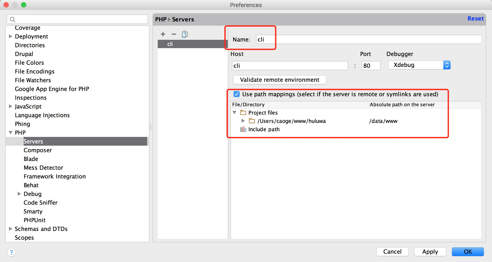

## 简介

> 1、统一的开发环境创建工具。使所有开发者的本地开发环境完全一致。

> 2、支持pm2管理

> 3、支持xdebug两种调试方式cli、web

## 修改HOST

```
# H5项目
192.168.33.10   www.shouyintv.dev
# 后台项目
192.168.33.10   monkey.shouyintv.dev
# API接口项目
192.168.33.10   api.shouyintv.dev
# wiki
192.168.33.10   wiki.shouyintv.dev
```

## 依赖

1. 下载安装VirtualBox

2. 下载安装Vagrant

3. 执行以下命令（如果是Windows系统，使用管理员身份运行cmd；尽量翻墙）
```
# 安装VirtualBox增强功能包
sudo vagrant plugin install vagrant-vbguest
# 如果安装hostsupdater可以不用配置上面《修改HOST》步骤（需要sudo权限，启动关闭需要输入root密码）
sudo vagrant plugin install vagrant-hostsupdater
```
4. 如果是Windows系统，下载安装Cygwin，需要安装支持ssh和rsync命令的模块

5. 如果是Windows系统，配置Cygwin环境变量，将Cygwin下的bin目录加到全局环境变量，重新以管理身份打开CMD窗口

## 使用

1. 在与其他WEB项目同级目录下，clone此项目

2. 进入vagrant项目目录

3. 日常开发操作命令
```
# 启动
vagrant up
# 重启
vagrant reload
# 关闭
vagrant halt
```

## PhpStorm支持xdebug的cli模式



## 好用的vagrant工具（可选）

#### 使用Vagrant Manager

> http://vagrantmanager.com/

## 内网其他应用服务环境说明

> http://192.168.1.234:1313/basics/env-test/

## 可能遇到的问题

#### ssh连接不上虚拟机

> 如果Vagrant是1.8.5版本（http://serverfault.com/questions/694172/how-to-change-the-ssh-auth-method-in-vagrant-from-password-to-private-key）

> 开启vagrant内的GUI配置，使用密码登录虚拟机，执行：

> chmod 700 ~/.ssh

> chmod 600 ~/.ssh/authorized_keys

#### 文件夹权限问题

> 在host物理机设置权限

#### xdebug使用PhpStorm点击开始监听的时候报错：port 9000 is busy

> 关闭host物理机fpm进程


## 开发规范

#### 分支创建

> 功能分支：feature/feature_name，基于最新master分支创建。

> 修复分支：hotfix/hotfix_name，基于最新master分支创建。

## TODO

> Windows不需要安装Cygwin